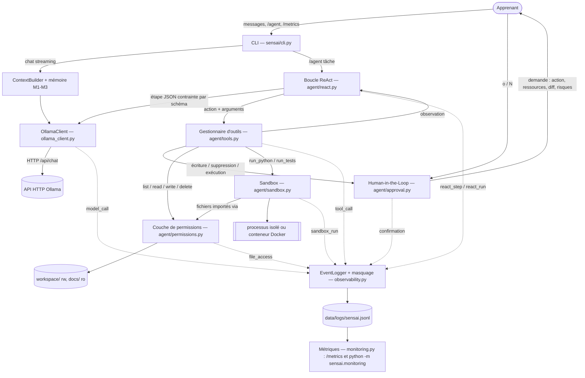

# Agent, sandbox, permissions, confirmations et observabilité

Ce document couvre les cinq features ajoutées à Sensai : **A1** ReAct, **T2** sandbox, **T4** fichiers avec permissions, **A3** Human-in-the-Loop et **EV3** logs & métriques. La partie mémoire et contexte (M1–M3) est décrite dans [memoire_contexte.md](memoire_contexte.md).

Cas d'usage fil rouge : Camille apprend le japonais avec Sensai. En plus des exercices en conversation, elle demande à l'agent de **préparer son matériel d'étude** : lire ses leçons, écrire des fiches de révision et de petits quiz Python, les **tester** avant de les enregistrer. Tout cela doit se faire **sans risque pour sa machine** et **sous son contrôle**.

---

## 1. État initial constaté

| Élément | État avant le travail |
|---|---|
| Sujet (PDF) | Python ≥ 3.10, pas de framework LLM, appels Ollama en HTTP direct ; README, requirements et user stories (≥ 2 par feature) attendus |
| Règles locales | pas de `README`, `AGENTS.md` ni `CONTRIBUTING` |
| Code | B1 (CLI streaming), M1, M2, M3 terminés (`sensai/`), benchmarks M2/M3 |
| Tests | aucun test automatisé |
| Environnement | seul Python 3.9 était installé, alors que le code exige ≥ 3.10 : Python 3.12 a été installé via Homebrew, dans un venv `.venv` |
| Git | branche `main`, propre. Le compte GitHub configuré n'avait au départ qu'une invitation en attente sur le dépôt. Après acceptation, le droit de push est arrivé avec un peu de retard |

Matrice des features demandées :

| Feature | Avant | Après |
|---|---|---|
| A1 ReAct | absente | ✅ complète |
| T2 Sandbox | absente | ✅ complète (subprocess ; Docker optionnel, non testé en réel) |
| T4 Fichiers + permissions | absente | ✅ complète |
| A3 Human-in-the-Loop | absente | ✅ complète |
| EV3 Logs & métriques | partielle : compteurs M2/M3 en SQLite et `/context`, sans journal structuré | ✅ complète |

---

## 2. Architecture



Ce diagramme suit le code : `build_agent()` (`cli.py`) crée `FileGuard`, `Sandbox`, `ApprovalGate(ConsoleApprover)`, `ToolRegistry` et `ReActAgent`, tous branchés sur le même `EventLogger`, qui est aussi celui de l'`OllamaClient`.

Déroulement d'une étape :

```
modèle → {"step_summary", "action", "args", "answer"}   (JSON imposé par le schéma Ollama `format`)
   │
   ├─ action == final_answer → fin
   └─ ToolRegistry.call(action, args)
         1. outil connu ? arguments valides ?               sinon → observation "error"
         2. niveau sensible ? → permission vérifiée d'abord   refus → "denied", sans rien demander à l'utilisateur
                              → confirmation demandée        refus → "refused"
         3. exécution : FileGuard (fichiers) / Sandbox (code)
         4. observation structurée → renvoyée au modèle, événement tool_call journalisé
```

---

## 3. Les cinq features

### A1 — Boucle de raisonnement ReAct (`agent/react.py`, `agent/tools.py`)

**Rôle.** L'agent enchaîne les étapes analyser → agir → observer → ajuster jusqu'à une réponse finale. Une erreur non récupérable ou une limite arrête la boucle.

- **Format d'une étape** : un objet JSON contraint par un schéma (`format` d'Ollama, le même mécanisme que M2/M3). `action` est un `enum` des outils + `final_answer` : le modèle ne peut pas inventer d'outil.
- **Limites** : `agent_max_steps` (8), `agent_max_parse_errors` (2 réponses invalides d'affilée), observations tronquées (`agent_observation_chars`), budget de tokens (les anciennes observations sont abrégées en premier).
- **Erreurs** : erreur d'outil, permission refusée, refus de l'utilisateur ou code qui plante → *observation*, le modèle se corrige. Modèle injoignable ou réponses invalides répétées → arrêt propre (`outcome = error`).
- **Trace** (`/trace`) : pour chaque étape, résumé public, action, arguments abrégés, statut, durée.
- **Chaîne de pensée privée** : le modèle produit seulement un `step_summary` d'une phrase, sans raisonnement détaillé. `think` reste désactivé, et la trace ne contient que ces résumés, les actions et leurs résultats.

**Intérêt pédagogique** : c'est le cœur d'un agent. On y voit concrètement la différence entre « le modèle parle » et « le modèle agit puis observe ». On y voit aussi pourquoi il faut des limites (boucles infinies, coût) et une validation stricte des sorties.

### T2 — Exécution de code en sandbox (`agent/sandbox.py`)

**Rôle.** L'agent exécute le code qu'il a écrit, ou un fichier du workspace, et récupère `stdout`, `stderr`, le code de sortie et un statut (`ok`, `error`, `timeout`, `output_limit`). Dans la démo réelle, le modèle a vu un `EOFError` dans `stderr` et a corrigé son quiz tout seul.

| Exigence | Mise en œuvre |
|---|---|
| durée maximale | `sandbox_timeout`, puis `SIGKILL` du **groupe de processus** (+ `RLIMIT_CPU`) |
| limite de sortie | `sandbox_max_output` octets par flux ; au-delà, le processus est tué (`output_limit`) |
| répertoire contrôlé | répertoire temporaire neuf à chaque exécution, supprimé ensuite ; seuls les fichiers fournis y sont copiés, et les fichiers du workspace passent par FileGuard |
| commandes autorisées | liste explicite `sandbox_runtimes` : `python` (fichier `main.py`) et `python-unittest` (découverte `test*.py`), aucun shell |
| processus bloqués | `start_new_session` + `killpg` : même les processus enfants orphelins sont tués (testé) |
| environnement | vide (pas de clé ni de jeton hérités), `python -I` (mode isolé), `RLIMIT_FSIZE`, `RLIMIT_NOFILE`, pas de core dump, `RLIMIT_AS` sous Linux |
| résultat structuré | `SandboxResult` ; le chemin hôte du répertoire temporaire est remplacé par `<sandbox>` |
| intégration ReAct | outils `run_python(code, files)` et `run_tests(files)` ; un échec renvoie `stderr` et la consigne de corriger |

**Backend Docker optionnel** (`sandbox_backend: "docker"`) : `--network none`, `--read-only`, `--cap-drop ALL`, `no-new-privileges`, utilisateur 65534, mémoire, CPU et nombre de processus limités, workspace monté en lecture seule, et `docker kill` en cas de délai dépassé.

**Intérêt pédagogique** : on apprend à faire la différence entre *contenir une erreur* et *contenir une attaque*, et à choisir le niveau d'isolation qui correspond à la menace réelle.

### T4 — Accès aux fichiers avec permissions (`agent/permissions.py`)

**Rôle.** `FileGuard` est le **seul** point d'accès au système de fichiers pour l'agent. Les outils fichiers et l'import de fichiers dans la sandbox passent par lui. Aucun outil n'appelle `open()` directement.

Vérifications, **avant** toute ouverture :
1. chemin normalisé, qui doit rester dans une racine autorisée (`file_roots`) : `..`, chemins absolus ailleurs, `~` et octets NUL sont refusés ;
2. liens symboliques refusés par défaut. Avec `file_allow_symlinks`, ils ne sont acceptés que si la **cible** est dans une racine, et c'est le mode de la racine cible qui s'applique ;
3. fichiers et dossiers cachés refusés (`.git`, `.env`, `.ssh`…) et absents des listings ;
4. extensions interdites (`.env`, `.pem`, `.key`, `.db`…) et liste blanche (`.md .txt .csv .json .py`) ;
5. écriture et suppression seulement dans une racine `rw` ;
6. taille maximale en lecture comme en écriture.

Les écritures sont atomiques (fichier temporaire puis `os.replace`) et les ouvertures utilisent `O_NOFOLLOW`. Chaque décision est journalisée (`file_access`, `allowed`, `reason`). Un *refus* (`PermissionDenied`) est bien distingué d'un *échec* (`FileOperationError` : fichier absent, binaire…), pour que les métriques restent justes.

**Intérêt pédagogique** : le principe du moindre privilège appliqué à un agent, et les attaques classiques (traversée de chemin, lien symbolique, TOCTOU).

### A3 — Human-in-the-Loop (`agent/approval.py`)

Avant une action **write**, **delete** (toujours) ou **execute** (configurable), l'agent se met en pause et affiche :
1. l'action proposée ;
2. les fichiers ou ressources concernés ;
3. un résumé du changement : **diff unifié** pour une écriture, extrait du fichier pour une suppression, extrait du code pour une exécution ;
4. les risques principaux (écrasement, suppression définitive, code généré, limites de la sandbox) ;
5. le motif donné par l'agent, puis attend `Confirmer ? [o/N]`.

Seuls `o`, `oui`, `y` et `yes` valident. Une ligne vide, `n`, Ctrl-D, Ctrl-C, l'absence de réponse avant `confirm_timeout` ou une erreur de l'approbateur **annulent** l'action. L'agent reçoit alors une observation « refusée, ne recommence pas ». La permission T4 est vérifiée **avant** de poser la question, pour qu'on ne demande jamais à l'utilisateur d'approuver une action interdite. Les lectures ne sont jamais confirmées : elles ne modifient rien et restent bornées par T4.

### EV3 — Logs & monitoring (`observability.py`, `monitoring.py`)

Un `EventLogger` unique écrit un événement JSON par ligne dans `data/logs/sensai.jsonl` (rotation à `log_max_bytes`). Chaque événement porte l'identifiant d'interaction.

| Événement | Contenu |
|---|---|
| `model_call` | modèle, usage (`chat`, `react_step`, `compression`, `memory_extraction`), statut (`ok`/`error`/`timeout`), durée, tokens prompt/sortie fournis par Ollama |
| `chat_turn` | durée du tour, tokens de contexte, messages écartés, interruption |
| `react_step` / `react_run` | index, action, statut, résumé public, durée / issue, nombre d'étapes |
| `tool_call` | outil, niveau, statut (`ok`/`error`/`denied`/`refused`), arguments masqués et tronqués, durée |
| `confirmation` | action, ressources, décision, temps d'attente |
| `file_access` | opération, chemin, autorisé ou non, raison |
| `sandbox_run` | runtime, backend, issue, code de sortie, durée, délai dépassé, troncature (tailles seulement, jamais la sortie) |

**Masquage** (appliqué à chaque événement avant écriture) :
- valeurs textuelles dont la clé est sensible (`password`, `token`, `api_key`, `authorization`…) → `***` ;
- secrets reconnus dans le texte → masqués : jetons Bearer, JWT, jetons GitHub, Slack, AWS, clés `sk-…`, clés privées, `user:pass@` dans les URL, `clé=valeur`, emails, numéros de carte et de téléphone ;
- textes tronqués à `log_content_chars` (120, ou 0 pour ne garder que les longueurs). Les prompts, réponses, contenus de fichiers et sorties de sandbox ne sont **jamais** journalisés en entier.

**Métriques** : `/metrics` dans le chat, ou `python -m sensai.monitoring [--last N] [--json]`. On y trouve le volume d'appels, la latence moyenne et p95, le taux d'erreurs, les délais dépassés, les tokens, les statistiques par outil, les issues ReAct, les confirmations, les accès fichiers et les exécutions en sandbox, et l'**évolution par jour** (dérive de latence).

---

## 4. Choix d'architecture, compromis et solutions écartées

| Choix | Pourquoi | Écarté |
|---|---|---|
| Étapes ReAct en JSON contraint par schéma | marche avec n'importe quel modèle Ollama, une seule action par étape, les erreurs de format sont détectées et relancées ; cohérent avec M2/M3 | *tool calling* natif d'Ollama : dépend du template du modèle, et les petits modèles l'utilisent mal ; format texte « Thought/Action » à parser : fragile, et il expose le raisonnement |
| `step_summary` public plutôt qu'un raisonnement | demandé : ne pas révéler de chaîne de pensée privée ; reste lisible pour la trace et la keynote | stocker le `thinking` du modèle |
| Sandbox subprocess par défaut, Docker en option | aucune dépendance, démarrage en ~40 ms, testable partout ; protège contre la vraie menace (erreurs du modèle). Docker isole réellement mais demande un démon et ~1 s par exécution | `exec()` dans le processus : aucune isolation ; seccomp/nsjail : non portable sur macOS |
| Une couche FileGuard unique | une seule logique de vérification à tester ; les outils et la sandbox ne peuvent pas la contourner | contrôles dispersés dans chaque outil |
| Permission vérifiée avant la confirmation | on ne demande jamais d'approuver une action impossible, ce qui évite d'habituer l'utilisateur à dire oui | demander d'abord, vérifier ensuite |
| `write`/`delete` toujours confirmés | ils modifient le projet ; la configuration ne peut pas les désactiver | confirmation entièrement configurable |
| Journal JSONL plutôt que SQLite ou un service | `tail -f`, `grep`, aucune dépendance, append-only, robuste aux lignes corrompues | Langfuse/Helicone : service externe, contraire à l'usage 100 % local |
| Masquage à l'écriture, pas à la lecture | aucun secret ne touche le disque | masquer seulement à l'affichage |

---

## 5. Limites de sécurité connues

- **Sandbox subprocess** : elle **n'est pas une frontière de sécurité contre du code malveillant**. Le code tourne avec le même utilisateur, a **accès au réseau**, et peut **lire** tout ce que cet utilisateur peut lire, ou écrire hors du répertoire temporaire avec un chemin absolu. Sous macOS, la mémoire n'est pas plafonnée (`RLIMIT_AS` ignoré). Pour exécuter du code non fiable, il faut utiliser `sandbox_backend: "docker"`. C'est pourquoi l'exécution est confirmée par défaut et que ce risque est affiché dans la demande de confirmation.
- **Backend Docker** : la commande générée est testée, mais l'exécution réelle n'a **pas pu être vérifiée** ici (démon Docker arrêté). Le test d'intégration existe et s'active avec `SENSAI_DOCKER_TESTS=1`.
- **TOCTOU** : `O_NOFOLLOW` protège le dernier composant du chemin. Si un répertoire intermédiaire est remplacé par un lien entre la vérification et l'ouverture, il n'est pas couvert, ce qui suppose un attaquant local déjà présent.
- **Masquage** : il repose sur des motifs. Un secret au format inconnu, dans un champ libre, peut passer, mais il est alors tronqué à 120 caractères.
- **Confirmation** : elle s'appuie sur la vigilance de l'utilisateur. Le diff est tronqué à 40 lignes pour les gros fichiers.
- **Injection de prompt** : un fichier lu par l'agent peut contenir des instructions. Leur impact est borné par T4 et A3, pas empêché.

---

## 6. Configuration et utilisation

Toutes les clés sont dans `config.json` (voir le tableau du [README](../README.md#configuration)). Exemple pour la démo :

```bash
.venv/bin/python -m sensai --model ministral-3:14b
> /profile set langue_cible japonais
> /tools
> /agent Écris un quiz Python à partir de docs/lecons/animaux.md, teste-le, puis enregistre-le dans workspace/quiz.py
> /trace
> /metrics
```

---

## 7. Tests réalisés

`.venv/bin/python -m unittest discover -s tests -v` → **74 tests, tous OK, 1 ignoré** (Docker réel), en ~7 s, sans réseau ni modèle.

| Fichier | Tests | Ce qui est vérifié |
|---|---|---|
| `test_observability.py` | 15 | masquage de 11 formats de secrets, pas de faux positif sur du texte normal, troncature, clés sensibles, JSONL, `timed`, rotation, erreurs d'E/S jamais levées, lignes corrompues, métriques, CLI de monitoring, instrumentation des appels Ollama (contenu jamais journalisé, timeout) |
| `test_permissions.py` | 20 | lecture/écriture/suppression nominales, lecture seule, traversée (`..`, absolu, `~`), NUL, fichiers cachés, extensions, tailles, binaire, liens symboliques vers l'extérieur (lecture, écriture, dossier), liens autorisés dans les racines, journalisation des refus |
| `test_sandbox.py` | 14 | stdout/code de sortie, traceback, chemins hôtes masqués, boucle infinie et `sleep` tués, limite de sortie, processus orphelins tués, environnement non hérité, répertoire neuf et supprimé, runtime unittest, refus (runtime, noms de fichiers), journalisation sans contenu, commande Docker verrouillée |
| `test_approval.py` | 11 | affichage complet de la demande, seul un « oui » explicite valide, EOF, Ctrl-C et délai = annulation, lectures non confirmées, write/delete obligatoires, approbateur défaillant = refus, journalisation |
| `test_agent.py` | 14 | **intégration** : code bogué → traceback observé → correction → écriture confirmée ; refus utilisateur ; permission refusée sans demande ; limite d'étapes ; réponses invalides ; modèle injoignable ; erreurs d'outils récupérables ; `run_tests` via FileGuard ; suppression confirmée ; budget de tokens ; journalisation et métriques de bout en bout ; commandes `/agent`, `/trace`, `/tools` |

**Essais réels avec Ollama** (`ministral-3:14b`) :
- Quiz : 7 étapes, `done`. L'agent a lu la leçon, écrit `quiz.py`, l'a exécuté, a vu `EOFError` (pas d'entrée standard dans la sandbox), l'a corrigé, a réexécuté avec succès (code 0), puis a terminé. 4 confirmations approuvées.
- Refus : lecture de `../demo/secret.env` refusée (hors racines), suppression de `workspace/quiz.py` refusée par l'utilisateur, fichier intact. Le journal ne contient pas la clé `sk-…` du fichier secret.

Non vérifié : backend Docker réel ; modèle par défaut `qwen3.8:4b` (non installé sur la machine de test).

---

## 8. Procédure de démonstration (keynote)

Scénario : *« Camille, étudiante, prépare son voyage au Japon. Elle révise le soir avec Sensai, sur son portable, hors ligne. »*

1. **Préparation** : `ollama serve`, modèle déjà téléchargé, `rm -rf workspace data/logs`, terminal en grande police. Avoir une capture ou un enregistrement de secours de chaque étape (un modèle de 14B met 5 à 15 s par étape).
2. **Tuteur** (base + mémoire) : `/profile set langue_cible japonais`, un mini-exercice en conversation.
3. **Agent + sandbox + HITL** : `/agent Écris un quiz Python à partir de docs/lecons/animaux.md, teste-le, puis enregistre-le dans workspace/quiz.py`. Montrer la demande de confirmation (code, risques), répondre `o`. Montrer l'erreur observée puis corrigée par l'agent, et le diff avant l'écriture.
4. **Permissions** : `/agent Lis le fichier ../config.json` → refus « hors des répertoires autorisés ». Puis `/agent Supprime workspace/quiz.py` → répondre `n` → fichier intact.
5. **Traçabilité** : `/trace` (résumés publics, actions, statuts, durées).
6. **Monitoring** : `/metrics`, puis `python -m sensai.monitoring` et `grep -c "sk-" data/logs/sensai.jsonl` → 0.
7. **Bilan honnête** : limites de la sandbox subprocess (section 5), latence d'un modèle local, ce qu'on ferait autrement (Docker par défaut).

---

## 9. User stories

### A1 — ReAct

**US-A1-1.** En tant qu'apprenante, je veux demander à Sensai de créer un quiz à partir de ma leçon, pour que l'agent enchaîne seul lecture, écriture et vérification.
Critères d'acceptation :
- l'agent lit la leçon avant d'écrire (étape `read_file` visible) ;
- chaque étape affiche un résumé, l'action, son statut et sa durée ;
- la boucle s'arrête sur `final_answer` avec une réponse en français.

**US-A1-2.** En tant qu'enseignante qui vérifie l'outil, je veux que l'agent s'arrête de lui-même s'il tourne en rond ou si le modèle tombe, pour ne jamais bloquer la séance.
Critères d'acceptation :
- au plus `agent_max_steps` actions, puis un message « pas terminé en N étapes » et un résumé ;
- si Ollama est injoignable, la boucle s'arrête avec un message clair, sans exception ;
- des réponses invalides sont relancées au plus `agent_max_parse_errors` fois ;
- `/trace` montre les étapes sans raisonnement interne détaillé.

### T2 — Sandbox

**US-T2-1.** En tant qu'apprenante, je veux que l'agent teste son quiz avant de me le donner, pour recevoir un programme qui fonctionne.
Critères d'acceptation :
- le résultat contient stdout, stderr et le code de sortie ;
- après une erreur, l'agent reçoit le traceback et propose une version corrigée ;
- le fichier n'est enregistré qu'après une exécution réussie (dans la démo).

**US-T2-2.** En tant qu'utilisatrice, je veux qu'un programme bogué ne puisse pas bloquer ni encombrer ma machine, pour utiliser l'agent sans crainte.
Critères d'acceptation :
- une boucle infinie est arrêtée après `sandbox_timeout` secondes (statut `timeout`) ;
- une sortie excessive est tronquée et le processus arrêté (`output_limit`) ;
- aucun fichier ni processus ne subsiste après l'exécution ; les variables d'environnement (clés, jetons) ne sont pas visibles.

### T4 — Fichiers avec permissions

**US-T4-1.** En tant qu'apprenante, je veux que l'agent puisse lire mes leçons mais seulement écrire dans `workspace/`, pour que mes cours de référence ne soient jamais modifiés.
Critères d'acceptation :
- `read_file docs/...` fonctionne, `write_file docs/...` est refusé (« lecture seule ») ;
- `write_file workspace/...` fonctionne après confirmation ;
- `/tools` affiche les répertoires, modes, extensions et la taille max.

**US-T4-2.** En tant que responsable sécurité, je veux que toute tentative de sortie du périmètre soit refusée et tracée, pour pouvoir auditer l'agent.
Critères d'acceptation :
- `../`, chemins absolus, liens symboliques vers l'extérieur, `.env` et fichiers cachés sont refusés avec une raison ;
- chaque accès et chaque refus produit un événement `file_access` ;
- le contenu des fichiers refusés n'apparaît ni dans les observations ni dans les logs.

### A3 — Human-in-the-Loop

**US-A3-1.** En tant qu'apprenante, je veux voir exactement ce que l'agent va écrire avant qu'il le fasse, pour garder la main sur mes fichiers.
Critères d'acceptation :
- la demande montre l'action, le fichier, un diff et les risques ;
- seul « o » ou « oui » lance l'action ;
- la décision est journalisée (`confirmation`).

**US-A3-2.** En tant qu'utilisatrice distraite, je veux qu'une absence de réponse ou un refus annule l'action sans casser la session, pour ne jamais valider par erreur.
Critères d'acceptation :
- une ligne vide, « n », Ctrl-D, Ctrl-C ou `confirm_timeout` dépassé annulent l'action ;
- le fichier visé est inchangé ;
- l'agent est informé du refus et propose autre chose ou termine, sans redemander la même action.

### EV3 — Logs & monitoring

**US-EV3-1.** En tant que développeur de Sensai, je veux voir la latence, les tokens et les erreurs par modèle, pour comparer les modèles et repérer une régression.
Critères d'acceptation :
- `/metrics` affiche le nombre d'appels, la latence moyenne et p95, les tokens, le taux d'erreurs et les délais dépassés ;
- les statistiques par outil, confirmation, accès fichier et sandbox sont visibles ;
- `python -m sensai.monitoring --json` fournit les mêmes données pour un script, avec l'évolution par jour.

**US-EV3-2.** En tant qu'apprenante, je veux que mes données personnelles et mes secrets ne soient jamais écrits dans les logs, pour pouvoir partager un log pour du débogage.
Critères d'acceptation :
- les prompts, réponses, contenus de fichiers et sorties de sandbox ne sont pas journalisés en entier ;
- les clés d'API, jetons, mots de passe, emails, numéros de carte et de téléphone sont masqués ;
- chaque événement porte un identifiant d'interaction qui relie modèle, outils et confirmations.

---

## 10. Évolutions possibles

- Sandbox Docker par défaut quand le démon est présent, avec une image pré-construite et un conteneur réutilisé pour réduire la latence.
- Confirmation « toujours autoriser cette action pour cette session », avec une portée limitée.
- Réutiliser la boucle ReAct pour les opérations mémoire M3 (outils `add_word`…), afin de remplacer l'extraction séparée.
- Exporter les métriques (OpenTelemetry) et un petit tableau de bord web (X1).
- Suite adversariale (EV4) : injections de prompt dans les fichiers lus par l'agent.
